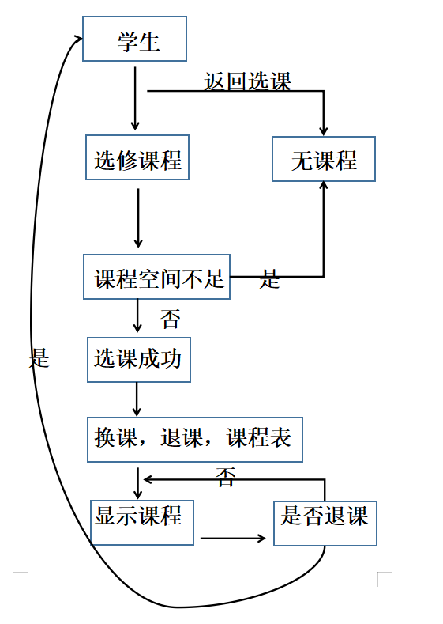
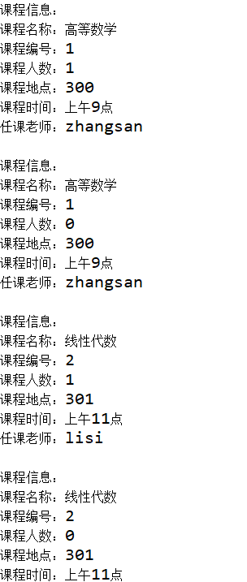

# 项目四（选课系统）

## 计G 公海旭 2020322112

# 一，实验目的
#### 初步了解分析系统需求，从学生选课角度了解系统中的实体及其关系，学会定义类中的属性以及方法；

#### 掌握面向对象的类设计方法（属性、方法）；

#### 掌握类的继承用法，通过构造方法实例化对象；

#### 学会使用super()，用于实例化子类；

#### 掌握使用Object根类的toString（）方法,应用在相关对象的信息输出中。

# 二，实验要求
#### 1.编写上述实体类以及测试主类（注意类之间继承关系的适用）

#### 2.在测试主类中，实例化多个类实体，模拟学生选课操作、打印课程信息（信息包括：编号、课程名称、上课地点、时间、授课教师 等）；模拟学生退课操作，再打印课程信息。

#### 3.编写实验报告。（要求有实验目的、要求、过程、流程图、核心代码、注释、系统运行截图、编程感想等，分章节罗列，不能在实验报告中粘帖大段代码）。

# 三，实验流程

# 四，核心代码
#### public String toString() {
#### 	return "课程信息：\n"
#### 				+ "课程名称："+getName()+"\n"
#### 				+ "课程编号："+getId()+"\n"
#### 				+ "课程人数："+students.size()+"\n"
#### 				+ "课程地点："+getRoom()+"\n"
#### 				+ "课程时间："+getcTime()+"\n"
#### 				+ "任课老师："+getTeacher().getName()+"\n";
	}

#  五，实验结果

# 六，编程感想

#### 在本次实验中经过多次尝试并不能满足实验要求，所以中途请教了同学，并且参考了一些同学的实验代码，才在大家的帮助下完成了本次实验，但在完成试验后进行回溯时发现对本次实验的理解有了更深的思考和理解，对于super的继承以及Object根类的运用有了更深的认识，也希望在下一步的实验中能够运用到这些知识。
